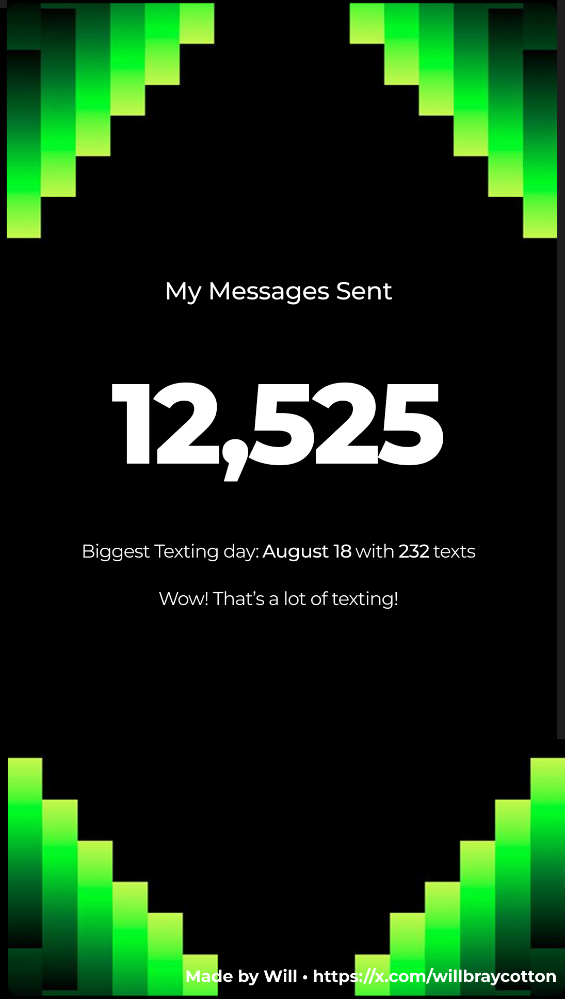

To analyze your iMessage history, ensure your messages are backed up on a Mac. If they are not already backed up, you can sync your iMessages to iCloud, download them onto your Mac, and then disable iCloud syncing.

Command for copying the chat database from your mac
```bash
cp ~/Library/Messages/chat.db ~/<path to repo>/chat.db
```


